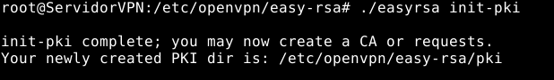
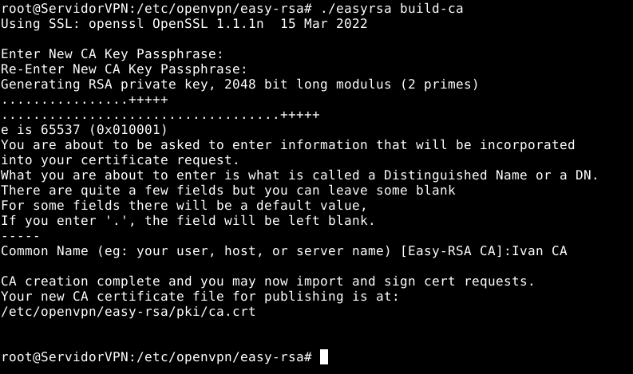
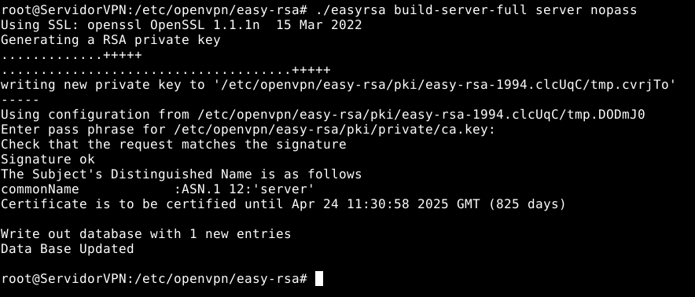
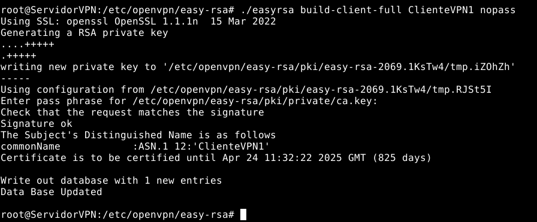
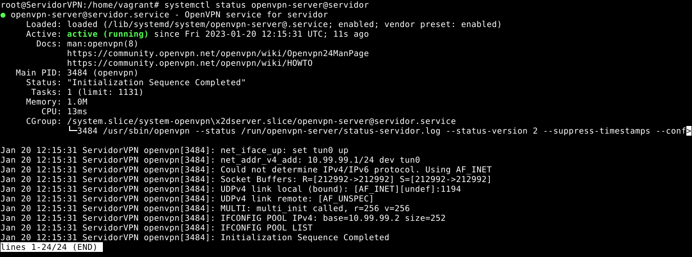
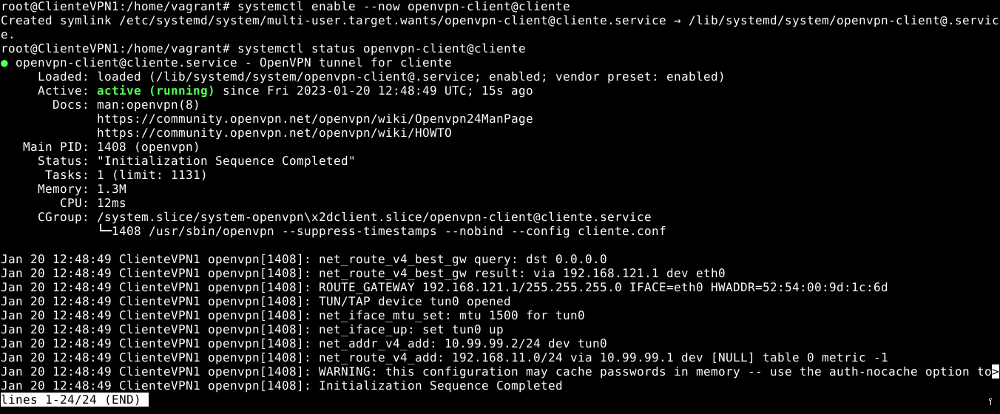
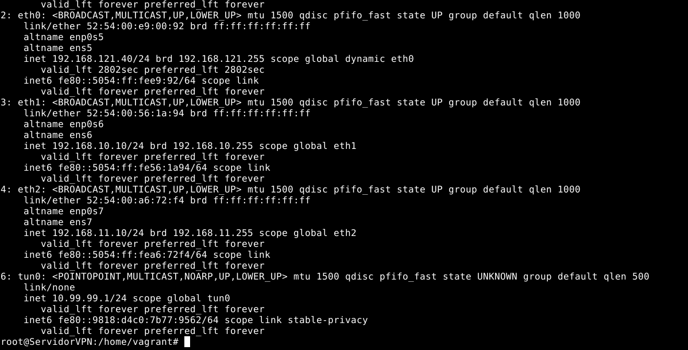
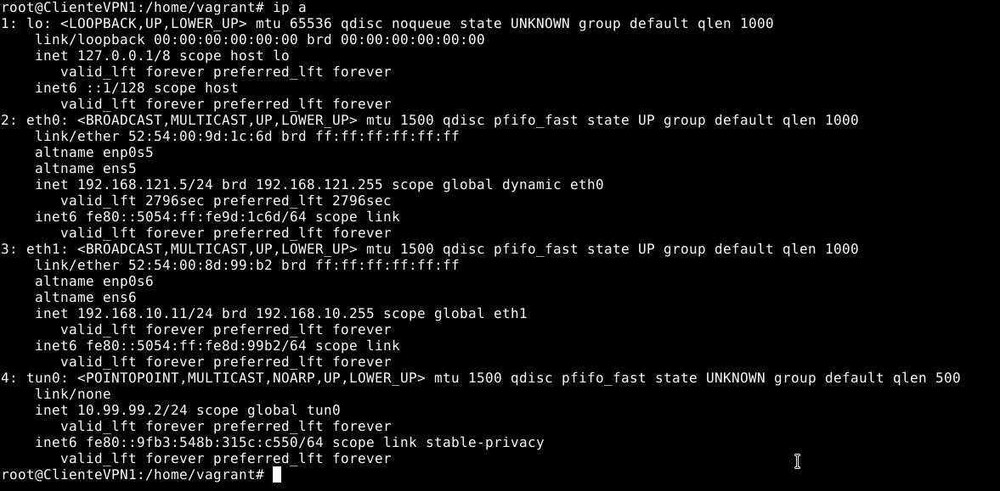
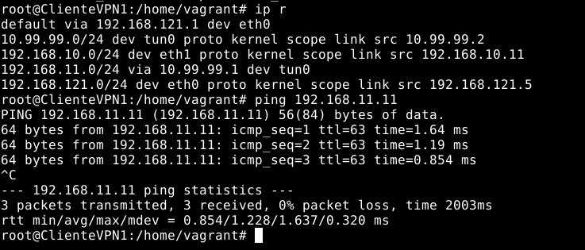
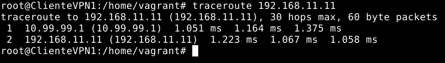

# **SAD Práctica 6**
## **Redes Privadas Virtuales**
#### Realizado por: **Iván Piña Castillo**

------------------------------------------------------------------------------------------------------------------------

## 1. VPN de acceso remoto con OpenVPN y certificados x509 (5 puntos)

     Configura una conexión VPN de acceso remoto entre dos equipos del cloud:

    • Uno de los dos equipos (el que actuará como servidor) estará conectado a dos redes 
    • Para la autenticación de los extremos se usarán obligatoriamente certificados digitales, que se generarán utilizando openssl y se almacenarán en el directorio /etc/openvpn, junto con  los parámetros Diffie-Helman y el certificado de la propia Autoridad de Certificación. 
    • Se utilizarán direcciones de la red 10.99.99.0/24 para las direcciones virtuales de la VPN. La dirección 10.99.99.1 se asignará al servidor VPN. 
    • Los ficheros de configuración del servidor y del cliente se crearán en el directorio /etc/openvpn de cada máquina, y se llamarán servidor.conf y cliente.conf respectivamente. 
    • Tras el establecimiento de la VPN, la máquina cliente debe ser capaz de acceder a una máquina que esté en la otra red a la que está conectado el servidor. 

    Documenta el proceso detalladamente.

### Creación del escenario

Para empezar vamos a crear el escenario usando vagrant. Para ello hemos creado el siguiente Vagrantfile:
```ruby
Vagrant.configure("2") do |config|
    config.vm.provider :libvirt do |libvirt|
        libvirt.memory = 1024
    end
    config.vm.define :nodo1 do |nodo1|
      nodo1.vm.box = "debian/bullseye64"
      nodo1.vm.hostname = "ServidorVPN"
      nodo1.vm.synced_folder ".", "/vagrant", disabled: true
      nodo1.vm.network :private_network,
	   :libvirt__network_name => "VPN1",
	   :libvirt__dhcp_enabled => false,
	   :ip => "192.168.10.10",
       :mode => "veryisolated"
      nodo1.vm.network :private_network,
       :libvirt__network_name => "VPN2",
       :libvirt__dhcp_enabled => false,
       :ip => "192.168.11.10",
       :libvirt__forward_mode => "veryisolated"
    end
    config.vm.define :nodo2 do |nodo2|
      nodo2.vm.synced_folder ".", "/vagrant", disabled: true
      nodo2.vm.box = "debian/bullseye64"
      nodo2.vm.hostname = "ClienteVPN1"
      nodo2.vm.network :private_network,
        :libvirt__network_name => "VPN1",
        :libvirt__dhcp_enabled => false,
        :ip => "192.168.10.11",
        :libvirt__forward_mode => "veryisolated"
    end
    config.vm.define :nodo3 do |nodo3|
        nodo3.vm.synced_folder ".", "/vagrant", disabled: true
        nodo3.vm.box = "debian/bullseye64"
        nodo3.vm.hostname = "ClienteVPN2"
        nodo3.vm.network :private_network,
          :libvirt__network_name => "VPN2",
          :libvirt__dhcp_enabled => false,
          :ip => "192.168.11.11",
          :libvirt__forward_mode => "veryisolated"
    end
end
```

Ahora, en la máquina que actúa como servidor debemos instalar openvpn y activar el bit de forwarding:
```bash
apt update
apt install openvpn
```
```bash
nano /etc/sysctl.conf
net.ipv4.ip_forward=1
```

A continuación copiaremos la configuración que se encuentra en /usr/share/easy-rsa a /etc/openvpn para evitar que futuras actualizaciones del paquete sobrescriban los cambios que hagamos:
```bash
cp -r /usr/share/easy-rsa /etc/openvpn
cd /etc/openvpn/easy-rsa/
```

Inicializamos el directorio PKI:
```bash
./easyrsa init-pki
```



Después vamos a generar el certificado de la CA y la clave con la que firmaremos los certificados de los clientes y el servidor.
```bash
./easyrsa build-ca
```

He usado como frase de paso 1234567890. Tal y como indica la salida del comando, el certificado se ha creado en /etc/openvpn/easy-rsa/pki/ca.crt, mientras la clave privada se encuentra en /etc/openvpn/easy-rsa/pki/private/ca.key.
  


Ahora tenemos que generar los parámetros Diffie-Hellman, los cuáles se usarán para el intercambio de claves durante el apretón de manos TLS entre el servidor de OpenVPN y los clientes que se conecten:
```bash
./easyrsa gen-dh
```


Como vemos, nos lo ha generado en /etc/openvpn/easy-rsa/pki/dh.pem.

A continuación generaremos el certificado y la clave privada del servidor OpenVPN:
```bash
./easyrsa build-server-full server nopass
```



- “nopass” deshabilita el uso de la frase de paso.

El certificado se ha guardado en /etc/openvpn/easy-rsa/pki/issued/server.crt y la clave privada se ha generado en /etc/openvpn/easy-rsa/pki/private/server.key.

Al igual que hemos hecho con el servidor, generaremos el certificado y la clave privada del cliente de la vpn (al que yo llamé ClienteVPN1):
```bash
./easyrsa build-client-full ClienteVPN1 nopass
```



El certificado y la clave privada necesarios para establecer la conexión VPN se han creado en /etc/openvpn/easy-rsa/pki/issued/ClienteVPN1.crt y /etc/openvpn/easy-rsa/pki/private/ClienteVPN1.key, respectivamente. Estos archivos tienen que ser transferidos al cliente para que la conexión sea efectiva. Para yo organizarme mejor, los he agrupado todos en una misma carpeta:
```bash
mkdir /home/vagrant/ClienteVPN1

cp -rp /etc/openvpn/easy-rsa/pki/{ca.crt,issued/ClienteVPN1.crt,private/ClienteVPN1.key} /home/vagrant/ClienteVPN1

chown -R vagrant: /home/vagrant/ClienteVPN1/

scp -r /home/vagrant/ClienteVPN1/ vagrant@192.168.10.11:
```

Ahora crearemos en el lado del servidor el fichero de configuración del túnel, el cual crearemos a partir del fichero de ejemplo que ya existe:
```bash
cp /usr/share/doc/openvpn/examples/sample-config-files/server.conf /etc/openvpn/server/servidor.conf
```
```bash
nano /etc/openvpn/server/servidor.conf 

port 1194
proto udp
dev tun

ca /etc/openvpn/easy-rsa/pki/ca.crt
cert /etc/openvpn/easy-rsa/pki/issued/server.crt
key /etc/openvpn/easy-rsa/pki/private/server.key
dh /etc/openvpn/easy-rsa/pki/dh.pem

topology subnet

server 10.99.99.0 255.255.255.0  # El rango de ip de la interfaz que se creará (el servidor coge por defecto la primera)
ifconfig-pool-persist /var/log/openvpn/ipp.txt

push "route 192.168.11.0 255.255.255.0" # La ruta que pasaremos al cliente de la vpn

keepalive 10 120
--data-ciphers-fallback 'AES-256-CBC'
persist-key
persist-tun
status /var/log/openvpn/openvpn-status.log
verb 3
explicit-exit-notify 1
```

Una vez creado este fichero en el servidor, podremos activar y habilitar el servicio:
```bash
systemctl enable --now openvpn-server@servidor
```



En el cliente que queremos que use la vpn (ClienteVPN1), tenemos que instalar el paquete openvpn:
```bash
apt install openvpn
```

- Movemos al lugar adecuado los ficheros que pasamos antes por scp:
```bash
mv ClienteVPN1/* /etc/openvpn/client/
```

- Y les cambiamos el propietario a root:
```bash
chown root: /etc/openvpn/client/*
```

Al igual que hicimos con el servidor, copiamos la plantilla de configuración del cliente y la modificamos para que tenga nuestra configuración:
```bash
cp /usr/share/doc/openvpn/examples/sample-config-files/client.conf /etc/openvpn/client/cliente.conf
```
```bash
nano /etc/openvpn/client/cliente.conf

client
dev tun
proto udp

remote 192.168.10.10 1194
resolv-retry infinite
nobind
persist-key
persist-tun

ca /etc/openvpn/client/ca.crt
cert /etc/openvpn/client/ClienteVPN1.crt
key /etc/openvpn/client/ClienteVPN1.key

remote-cert-tls server
--data-ciphers-fallback 'AES-256-CBC'
verb 3
```

Habilitamos y levantamos el servicio:
```bash
systemctl enable --now openvpn-client@cliente
```

Verificamos si el servicio del cliente está funcionando correctamente:
```bash
systemctl status openvpn-client@cliente
```

Verificamos si el servicio del servidor está funcionando correctamente:
```bash
systemctl status openvpn-server@servidor
```



Podemos ver que, tanto en el servidor como en el cliente, se han creado dos interfaces llamadas “tun0” con la ip que asignamos en el servidor:





En el cliente interno (lo he llamado ClienteVPN2, aunque de Cliente VPN tiene mas bien poco) solo tenemos que cambiar la ruta por defecto para que use el servidor:
```bash
ip route del default
ip route add default via 192.168.11.10
```

Pruebas de funcionamiento (todas hechas desde ClienteVPN1):

- Ping a ClienteVPN2:



- Traceroute a ClienteVPN2:



Como vemos, el ClienteVPN1 puede hacer ping perfectamente a la máquina en la otra red y si vemos la salida del comando traceroute, atraviesa el túnel para llegar a su destino.

------------------------------------------------------------------------------------------------------------------------


