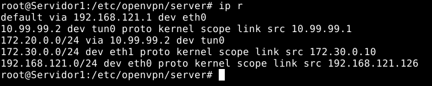
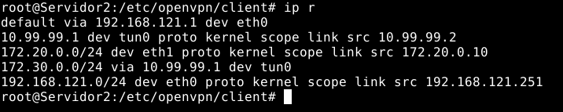

# **SAD Práctica 6**
## **Redes Privadas Virtuales**
#### Realizado por: **Iván Piña Castillo**

------------------------------------------------------------------------------------------------------------------------

## 2. VPN sitio a sitio con OpenVPN y certificados x509 (10 puntos)

    Configura una conexión VPN sitio a sitio entre dos equipos del cloud:

    • Cada equipo estará conectado a dos redes, una de ellas en común 
    • Para la autenticación de los extremos se usarán obligatoriamente certificados digitales, que se generarán utilizando openssl y se almacenarán en el directorio /etc/openvpn, junto con con los parámetros Diffie-Helman y el certificado de la propia Autoridad de Certificación. 
    • Se utilizarán direcciones de la red 10.99.99.0/24 para las direcciones virtuales de la VPN. 
    • Tras el establecimiento de la VPN, una máquina de cada red detrás de cada servidor VPN debe ser capaz de acceder a una máquina del otro extremo.

    Documenta el proceso detalladamente.

### Creación de los escenarios

Para esta parte de la práctica, he optado por hacerla en dos escenarios Vagrant, por lo cuál en esta parte habrá dos Vagrantfiles diferentes (lo he hecho así para organizarme mejor):

El Vagrantfile del primer escenario que montaremos (el que actuará como servidor):
```ruby
Vagrant.configure("2") do |config|
    config.vm.provider :libvirt do |libvirt|
        libvirt.memory = 1024
    end
    config.vm.define :nodo1 do |nodo1|
      nodo1.vm.box = "debian/bullseye64"
      nodo1.vm.hostname = "Servidor1"
      nodo1.vm.synced_folder ".", "/vagrant", disabled: true
      nodo1.vm.network :private_network,
        :libvirt__network_name => "privadaVPN",
        :libvirt__dhcp_enabled => false,
        :ip => "172.30.0.10",
        :netmask => "255.255.255.0",
        :libvirt__forward_mode => "veryisolated"
    end
    config.vm.define :nodo2 do |nodo2|
      nodo2.vm.synced_folder ".", "/vagrant", disabled: true
      nodo2.vm.box = "debian/bullseye64"
      nodo2.vm.hostname = "Cliente1"
      nodo2.vm.network :private_network,
        :libvirt__network_name => "privadaVPN",
        :libvirt__dhcp_enabled => false,
        :ip => "172.30.0.11",
        :netmask => "255.255.255.0",
        :libvirt__forward_mode => "veryisolated"
     end
  end
```

El Vagrantfile del segundo escenario que montaremos (el que actuará como cliente):
```ruby
Vagrant.configure("2") do |config|
    config.vm.provider :libvirt do |libvirt|
        libvirt.memory = 1024
    end
    config.vm.define :nodo1 do |nodo1|
      nodo1.vm.box = "debian/bullseye64"
      nodo1.vm.hostname = "Servidor2"
      nodo1.vm.synced_folder ".", "/vagrant", disabled: true
      nodo1.vm.network :private_network,
        :libvirt__network_name => "privadaVPN2",
        :libvirt__dhcp_enabled => false,
        :ip => "172.20.0.10",
        :netmask => "255.255.255.0",
        :libvirt__forward_mode => "veryisolated"
    end
    config.vm.define :nodo2 do |nodo2|
      nodo2.vm.synced_folder ".", "/vagrant", disabled: true
      nodo2.vm.box = "debian/bullseye64"
      nodo2.vm.hostname = "Cliente2"
      nodo2.vm.network :private_network,
        :libvirt__network_name => "privadaVPN2",
        :libvirt__dhcp_enabled => false,
        :ip => "172.20.0.11",
        :netmask => "255.255.255.0",
        :libvirt__forward_mode => "veryisolated"
     end
  end
```

Tendremos el siguiente escenario:

     En el escenario 1 (172.30.0.0/24): Hay dos máquinas conectadas a través de una red interna. La máquina "Servidor1" tendrá una conexión a internet y será alcanzable por "Servidor2", mientras que la máquina "Cliente1" sólo será capaz de acceder a "Servidor1".

     En el escenario 2 (172.20.0.0/24): También hay dos máquinas, incluyendo "Servidor2" que será accesible desde la máquina "Servidor1" y su cliente "Cliente2", este último solo tendrá conexión a "Servidor2".

### Configuración en el escenario 1 (Servidor)

En primer lugar tendremos que crear un fichero llamado vars (cuyo contenido lo sacaremos de una plantilla que hay en el mismo directorio), para que contenga la información que después tendrá nuestra Autoridad Certificadora:
```bash
apt install openvpn

cd /usr/share/easy-rsa/

cp vars.example vars
```
```bash
nano vars

set_var EASYRSA_REQ_COUNTRY     "ES"
set_var EASYRSA_REQ_PROVINCE    "Sevilla"
set_var EASYRSA_REQ_CITY        "Dos Hermanas"
set_var EASYRSA_REQ_ORG         "Ivan Corp"
set_var EASYRSA_REQ_EMAIL       "ivanpicas88@gmail.com"
set_var EASYRSA_REQ_OU          "Ejercicio VPN"
```

Ahora tendremos que crear el directorio en el que se almacenarán todos los documentos de la Autoridad Certificadora (certificados, claves, base de datos, etc):
```bash
./easyrsa init-pki
```
 

Por último, antes de crear la Autoridad Certificadora, tendremos que crear una clave “Diffie-Hellman”:
```bash
./easyrsa gen-dh
```


Ahora ya podemos crear la Autoridad Certificadora:
```bash
./easyrsa build-ca
```


Ya tenemos nuestra Autoridad Certificadora lista, por lo que lo primero que tenemos que hacer es crear y firmar el certificado que usará nuestra máquina “Servidor1”:
```bash
./easyrsa gen-req server
```


```bash
./easyrsa sign-req server server
```


Una vez que hemos creado el certificado del servidor y lo hemos firmado, pasemos a crear y firmar el certificado que usará la máquina “Servidor2” del escenario 2 para acceder a la VPN:
```bash
./easyrsa gen-req vpn_escenario2
```


```bash
./easyrsa sign-req client vpn_escenario2
```


Ahora vamos a tener que copiar los ficheros que necesitaremos para que el servidor vpn funcione en /etc/openvpn/server:
```bash
cp ca.crt /etc/openvpn/server/

cp dh.pem /etc/openvpn/server/

cp issued/server.crt /etc/openvpn/server/

cp private/server.key /etc/openvpn/server/
```

Tenemos que hacer llegar a la máquina “Servidor2” los ficheros que necesitará para conectarse a mi servidor VPN. En mi caso he usado scp::
```bash
scp ca.crt vagrant@192.168.121.251:

scp issued/vpn_escenario2.crt vagrant@192.168.121.251:

scp private/vpn_escenario2.key vagrant@192.168.121.251:
```

En este momento tendremos que crear el fichero de configuración del servidor vpn, para lo cual podremos apoyarnos en una plantilla que nos ofrece el paquete de OpenVPN:
```bash
cp /usr/share/doc/openvpn/examples/sample-config-files/server.conf /etc/openvpn/server/servidor.conf
```
```bash
nano /etc/openvpn/server/servidor.conf

dev tun    # La interfaz que se creará será de tipo tun, es decir, encapsula IPv4 o IPv6

ifconfig 10.99.99.1 10.99.99.2     # Indicamos la ip de este lado del túnel (10.99.99.1) y la ip del otro extremo del túnel (10.99.99.2)

route 172.20.0.0 255.255.255.0     # Indicamos la ruta de la red(es) a la que llevará el túnel. 

tls-server # Indica que esta máquina va a funcionar como servidor en modo seguro (activando las capas de TLS activadas)

ca ca.crt  # Certificado de la autoridad certificadora

cert server.crt  # Certificado del servidor firmado por la autoridad certificadora

key server.key   # Clave privada que corresponde al certificado anterior

dh dh.pem  # Parámetros de Diffie-Hellman que hemos generado antes

keepalive 10 120  #  Indica el intervalo en que los extremos del túnel comprueban si están conectados (10 segundos). Si no hay ninguna respuesta en 120 segundos se asume que el otro lado del túnel está caído

log /var/log/openvpn/server.log   # La ruta del log de openvpn

verb 3   #  Nivel de verbosidad del log, siendo 0 lo mínimo y 9 el máximo

askpass contra.txt   #  Fichero donde hemos guardada la contraseña (fase de paso) del certificado. Es recomendable cambiar los permisos del fichero para aumentar la seguridad, tendremos que crearla antes de ejecutar el servidor.
```

Ahora podemos iniciar el servicio en el lado del servidor:
```bash
systemctl start openvpn-server@servidor
```

Podemos ver el servicio activo:


No debemos olvidar el bit de forwarding en el servidor:
```bash
echo 1 > /proc/sys/net/ipv4/ip_forward
```

También en el cliente del escenario 1 debemos cambiar la ruta por defecto:
```bash
ip r del default

ip r add default via 172.30.0.10
```

Con esto hemos terminado en el lado del escenario 1.

### Configuración en el escenario 2 (Cliente)

En este escenario tenemos que configurar la máquina “Servidor2” para que actúe como el otro extremo del túnel vpn. Para ello, lo primero es mover los ficheros que enviamos desde el escenario 1 a la carpeta adecuada:
```bash
mv ca.crt /etc/openvpn/client/
mv vpn_escenario2.crt /etc/openvpn/client/
mv vpn_escenario2.key /etc/openvpn/client/
```

Ahora crearemos el fichero de configuración de esta máquina. Para ello tenemos un modelo que podemos seguir, al igual que pasó con el apartado anterior:
```bash
cp /usr/share/doc/openvpn/examples/sample-config-files/client.conf /etc/openvpn/client/cliente.conf
```

```bash
nano /etc/openvpn/client/cliente.conf

dev tun   # La interfaz que se creará será de tipo tun, es decir, encapsula IPv4 o IPv6

remote 192.168.121.126  # La ip del servidor en la que estará el otro extremo del túnel

ifconfig 10.99.99.2 10.99.99.1  # Indicamos la ip de este lado del túnel (10.99.99.2) y la ip del otro extremo del túnel (10.99.99.1)

route 172.30.0.0 255.255.255.0  # Indicamos la ruta de la red(es) a la que llevará el túnel.

tls-client  # Indica que esta máquina va a funcionar como cliente en modo seguro (activando las capas de TLS activadas)

ca ca.crt  # Certificado de la autoridad certificadora

cert vpn_escenario2.crt  # Certificado del cliente firmado por la autoridad certificadora

key vpn_escenario2.key  # Clave privada que corresponde al certificado anterior

keepalive 10 60  # Indica el intervalo en que los extremos del túnel comprueban si están conectados (10 segundos). Si no hay ninguna respuesta en 60 segundos se asume que el otro lado del túnel está caído

verb 3  # Nivel de verbosidad del log, siendo 0 lo mínimo y 9 el máximo

askpass contra2.txt # Fichero donde hemos guardada la contraseña (fase de paso) del certificado. Es recomendable cambiar los permisos del fichero para aumentar la seguridad (tendremos que crearla antes de ejecutar el servidor).
```
Ahora iniciamos el servicio:
```bash
systemctl start openvpn-client@cliente
```

Vamos a comprobar que el servicio está funcionando correctamente:


También debemos activar el ip de forwarding en esta máquina:
```bash
echo 1 > /proc/sys/net/ipv4/ip_forward
```

Al igual que antes, también debemos cambiar la ruta del cliente en este escenario:
```bash
ip r del default

ip r add default via 172.20.0.10
```

Ya hemos terminado de configurar este escenario y podemos pasar a hacer las pruebas:

- Las rutas del servidor del escenario 1:



- Las rutas del servidor del escenario 2:



- Desde el cliente del escenario 1:


- Desde el cliente del escenario 2:


------------------------------------------------------------------------------------------------------------------------
