# **SAD Práctica 6**
## **Redes Privadas Virtuales**
#### Realizado por: **Iván Piña Castillo**

------------------------------------------------------------------------------------------------------------------------

## 3. VPN de acceso remoto con WireGuard (5 puntos)

    Monta una VPN de acceso remoto usando Wireguard. Intenta probarla con clientes Windows, Linux y Android. Documenta el proceso adecuadamente y compáralo con el del apartado A.

Vamos a establecer una VPN de acceso remoto con Wireguard, la cual conectará tres clientes con una red interna. Estos clientes incluyen una máquina Debian 11, una máquina Windows 10, y una máquina Android. Para probar el funcionamiento, he creado una máquina Debian conectada a una red interna para que los clientes puedan acceder a ella a través del túnel VPN creado.

### Cliente Interno:
A continuación el Vagrantfile del cliente interno:
```ruby
Vagrant.configure("2") do |config|
    config.vm.provider :libvirt do |libvirt|
        libvirt.memory = 1024
    end
    config.vm.define :nodo1 do |nodo1|
      nodo1.vm.box = "debian/bullseye64"
      nodo1.vm.hostname = "Cliente-Interno"
      nodo1.vm.synced_folder ".", "/vagrant", disabled: true
      nodo1.vm.network :private_network,
        :libvirt__network_name => "Privada",
        :libvirt__dhcp_enabled => false,
        :ip => "192.168.20.10",
        :libvirt__netmask => '255.255.255.0',
        :mode => "veryisolated"
     end
  end
```

En este cliente solo cambiaremos la ruta por defecto:
```bash
ip r del default

ip r add default via 192.168.20.1
```

### Servidor

A conticuación el Vagrantfile del cliente interno:
```ruby
Vagrant.configure("2") do |config|

    config.vm.provider :libvirt do |v|
      v.memory = 1024
      end
    config.vm.define :nodo1 do |nodo1|
      nodo1.vm.box = "debian/bullseye64"
      nodo1.vm.hostname = "Server-VPN"
      nodo1.vm.synced_folder ".", "/vagrant", disabled: true
      nodo1.vm.network :private_network,
      :libvirt__network_name => "VPN3",
      :libvirt__dhcp_enabled => false,
      :ip => "192.168.99.10",
      :libvirt__netmask => '255.255.255.0',
      :libvirt__forward_mode => "veryisolated"
      nodo1.vm.network :private_network,
        :libvirt__network_name => "Privada",
        :libvirt__dhcp_enabled => false,
        :ip => "192.168.20.1",
        :libvirt__netmask => '255.255.255.0',
        :mode => "veryisolated"
     end
 end
```

Así pues, comencemos con la configuración del servidor. Lo primero es instalar el paquete:
```bash
apt install wireguard
```

Tenemos que asegurarnos de haber activado el bit de forwarding en nuestro servidor:
```bash
nano /etc/sysctl.conf

net.ipv4.ip_forward = 1
```

Para que el cambio tenga efecto, tendremos que ejecutar el siguiente comando:
```bash
sysctl -p
```

Ahora vamos a tener que crear los ficheros de configuración necesarios en el directorio base de wireguard:
```bash
cd /etc/wireguard/
```

Ahora, generaremos el par de claves usando el comando que nos proporcionan en la página oficial de Wireguard:
```bash
wg genkey | tee serverprivatekey | wg pubkey > serverpublickey
```
```bash
cat serverprivatekey
IGkz3XEzlEDdOt4/2WQ51liVpMBH8hOZQIBZSuwsnEE=
```
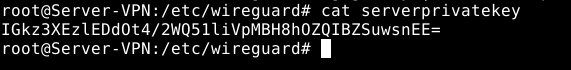

```bash
cat serverpublickey
4vaeIibx/PXkKedQKHyPY8V11aQmknr21Q6yYHMUMlE=
```
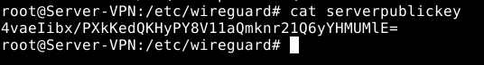

En este momento crearemos el fichero de configuración, que tendrá de nombre la interfaz que se creará (wg0):
```bash
nano wg0.conf

# Server config
[Interface]
Address = 10.99.99.1
PrivateKey = IGkz3XEzlEDdOt4/2WQ51liVpMBH8hOZQIBZSuwsnEE= # Clave privada del servidor
ListenPort = 51820
```

En el fichero anterior nos encontramos con un bloque llamado “Interface” que contiene lo siguiente:

    Address: La dirección IP del servidor que albergará la VPN es necesaria para hacer un seguimiento de las conexiones entrantes y salientes.
    PrivateKey: La clave privada generada para el servidor garantizará seguridad adicional.
    ListenPort: Para mejorar la seguridad, también se recomienda especificar un puerto de escucha para Wireguard.

En este momento ya podemos activar la interfaz que hemos creado:
```bash
wg-quick up wg0
```
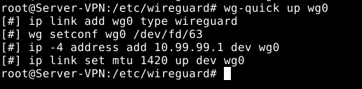

Para desactivarla sería tan sencillo como:
```bash
wg-quick down wg0
```
Podemos ver que el servidor se encuentra activo con:
```bash
wg
```
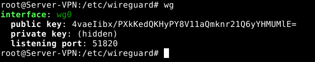

También podemos ver que se ha creado la interfaz que hemos definido:

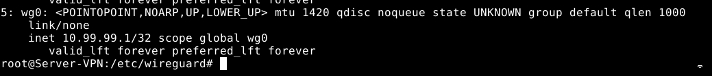

Hemos completado la configuración básica del servidor. Ahora procederemos a configurar los clientes.

### Cliente Linux (Debian 11)

El Vagrantfile del cliente:
```ruby
Vagrant.configure("2") do |config|

    config.vm.provider :libvirt do |v|
      v.memory = 1024
    end
    config.vm.define :nodo1 do |nodo1|
      nodo1.vm.box = "debian/bullseye64"
      nodo1.vm.hostname = "Cliente-Linux"
      nodo1.vm.synced_folder ".", "/vagrant", disabled: true
      nodo1.vm.network :private_network,
      :libvirt__network_name => "VPN3",
      :libvirt__dhcp_enabled => false,
      :ip => "192.168.99.11",
      :libvirt__netmask => '255.255.255.0',
      :libvirt__forward_mode => "veryisolated"
    end
end
```

Al igual que hicimos con el servidor, tendremos que instalar wireguard y crear el par de claves:
```bash
apt install wireguard

cd /etc/wireguard/

wg genkey | tee clientprivatekey | wg pubkey > clientpublickey
```
```bash
cat clientprivatekey
QC9vMrRVf1zWwaeEuuOyvHDpBDC9ROsoTqQsSVQtR14=
```
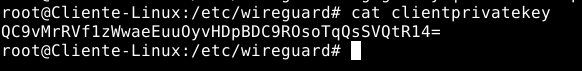

```bash
cat clientpublickey
4srF53WRGSsa/A5iHiRrmR4juXaNSaYRdecy1Gpd6DI=
```
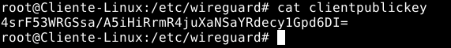

Al igual que hicimos en el servidor, también crearemos un fichero de configuración con la siguiente información:
```bash
nano wg0.conf

[Interface]
Address = 10.99.99.2
PrivateKey = QC9vMrRVf1zWwaeEuuOyvHDpBDC9ROsoTqQsSVQtR14= # Clave privada del cliente
ListenPort = 51820

[Peer]
PublicKey = 4vaeIibx/PXkKedQKHyPY8V11aQmknr21Q6yYHMUMlE= # Clave pública del servidor
AllowedIPs = 0.0.0.0/0
Endpoint = 192.168.99.10:51820
```

La configuración de la interfaz en el lado del cliente es similar a la del servidor, con una adición: un bloque llamado "Peer". Este bloque contiene información que será replicada en el servidor. Incluye los siguientes datos:

    PublicKey: La clave pública del servidor.
    PostUp: Ruta estática a la red interna para que podamos conectarnos a ella
    AllowedIPs: Contiene una lista de direcciones IP desde las que se permitirá el tráfico, actuando como un firewall en Wireguard. 
    Endpoint: Es la dirección IP del servidor Wireguard que acabamos de establecer.

Con esto ya podemos activar la interfaz que hemos configurado:
```bash
wg-quick up wg0
```
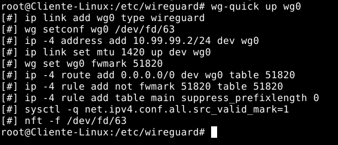

También podemos ver la interfaz que hemos creado:

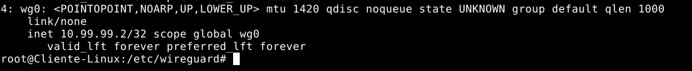

Ya tenemos el cliente configurado, así que ahora debemos agregar el "Peer" al lado del cliente. Esto se debe hacer por cada cliente conectado. Esto es lo que el fichero de configuración del servidor parecerá cuando esté terminado:
```bash
nano wg0.conf

# Server config
[Interface]
Address = 10.99.99.1
PrivateKey = IGkz3XEzlEDdOt4/2WQ51liVpMBH8hOZQIBZSuwsnEE= # Clave privada del servidor
ListenPort = 51820

# Clients configs

# Cliente Debian 11
[Peer]
Publickey = 4srF53WRGSsa/A5iHiRrmR4juXaNSaYRdecy1Gpd6DI= # Clave pública del cliente
AllowedIPs = 10.99.99.2/32
PersistentKeepAlive = 25
```

En el bloque “Peer” hemos incluido lo siguiente:

    PublicKey: La clave pública del cliente.
    PersistentKeepAlive: Si no hay intercambio de paquetes entre las máquinas tras 25 segundos, se enviará un paquete para averiguar si la conexión sigue activa.

Con este bloque que hemos añadido, ya podemos reiniciar el servicio:
```bash
wg-quick down wg0
```

    
```bash
wg-quick up wg0
```
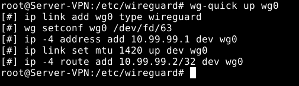

Podemos ver el servicio activado con el cliente conectado:
```bash
wg
```
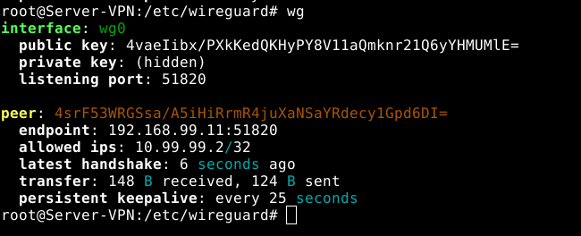

Con esto ya hemos terminado completamente con el lado del cliente Linux. Probemos si ha funcionado:

- Ping y traceroute desde el cliente VPN a la red interna:

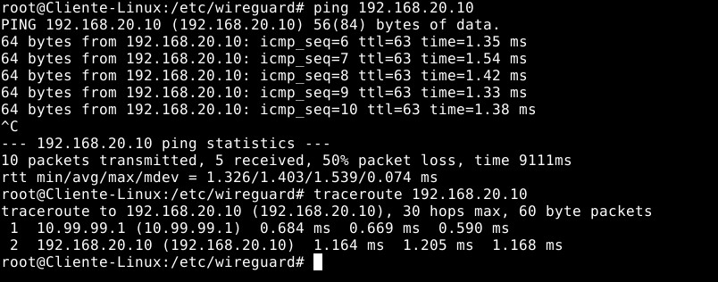

- Ping y traceroute desde el cliente interno al cliente VPN:

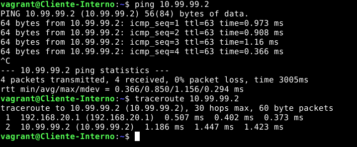


## Cliente Windows (Windows 10)

Configuro estáticamente la interfaz:
```cmd
netsh interface ip set address name="Ethernet" static 192.168.99.12 255.255.255.0 192.168.99.10
```


Instalar el programa de Windows desde la página oficial es el primer paso. Después, al abrirlo, debemos crear un túnel vacío (empty tunnel). Al pulsar el botón, Windows nos generará automáticamente las claves necesarias. Finalmente, el fichero de configuración se rellenará de la forma correspondiente.

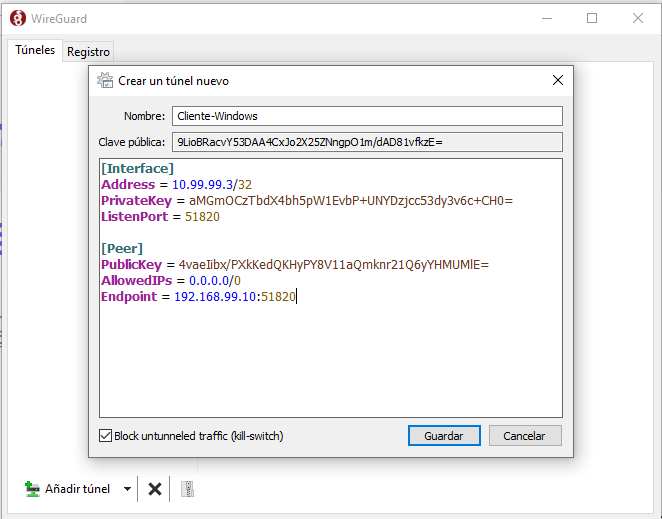

Una vez hecho esto, pasamos al lado del servidor, en el cual tendremos que añadir un nuevo bloque “Peer” al igual que hicimos con el cliente linux:
```bash
nano /etc/wireguard/wg0.conf
 
# Server config
[Interface]
Address = 10.99.99.1
PrivateKey = AMY15UaxVGBf5RZGRTQ+GdO5sGZgopQnBW3zocHKG3k= # Clave privada del servidor
ListenPort = 51820

# Clients configs

# Cliente Debian 11
[Peer]
Publickey = QjJfegKzofdcjbpu4Gjl0TX6g0Wj7w1hTHTJNa2cplE= # Clave pública del cliente
AllowedIPs = 10.99.99.2/32
PersistentKeepAlive = 25

# Cliente Windows 10
[Peer]
Publickey = 9LioBRacvY53DAA4CxJo2X25ZNngpO1m/dAD81vfkzE= # Clave pública del cliente
AllowedIPs = 10.99.99.3/32
PersistentKeepAlive = 25
```

Ahora que lo hemos hecho, podemos reiniciar el servicio en el servidor:
```bash
wg-quick down wg0

wg-quick up wg0
```

Una vez iniciado en el servidor, activamos el túnel en el cliente windows:

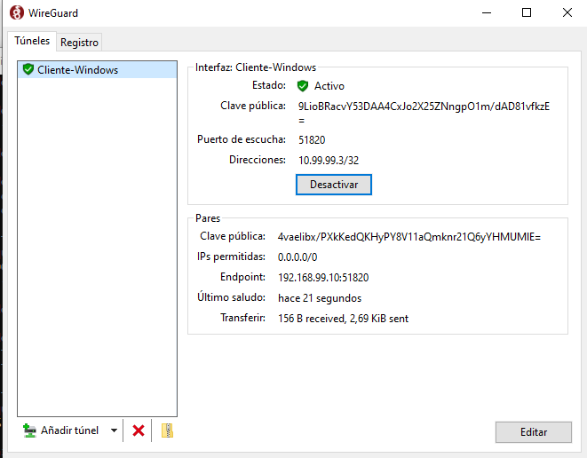

Podemos ver en el lado del servidor que se ha añadido un nuevo “Peer”:

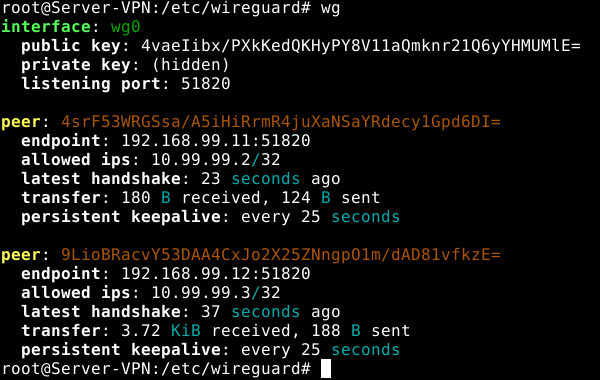

Ahora hagamos las pruebas:

- Ping y traceroute desde el cliente windows a la red interna:

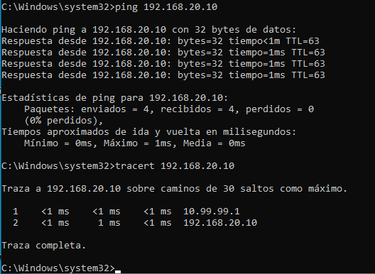

- Ping y traceroute desde el cliente windows al cliente linux:

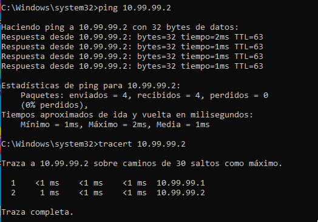

### Cliente Android (Android 11)
    Para este ejercicio, he usado un móvil real con Android 11 en lugar de una máquina virtual. Es por ello que ahora el servidor VPN será mi anfitrión en lugar de la máquina virtual. Esto no afecta a la configuración del cliente Android, ya que la configuración del servidor es la misma.

Para usar Wireguard con Android, primero tenemos que descargarnos la aplicación desde la playstore:

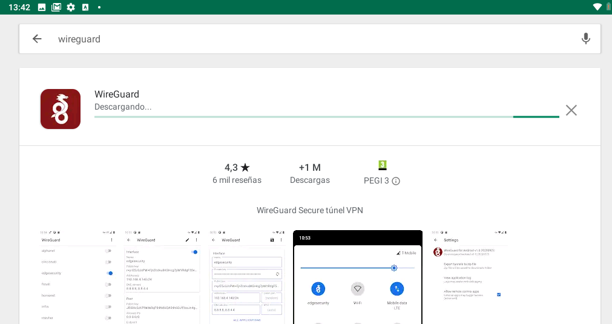

Una vez en la aplicación, veremos que nos da tres opciones para crear el túnel:

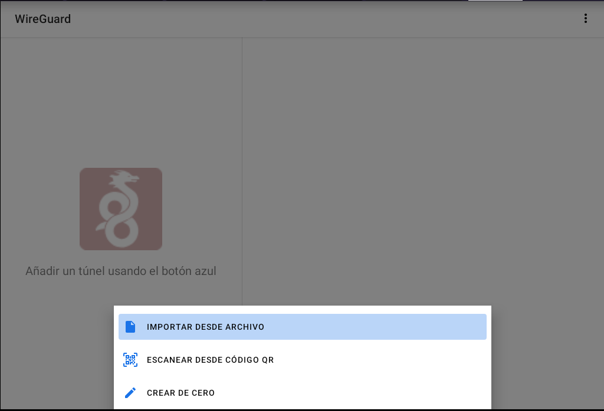

En nuestro caso, considero que es más sencillo usar la opción de “escanear desde código QR”. Para ello, primero tendremos que crear el fichero de configuración en nuestra máquina, y después nos descargaremos un paquete para convertir dicho fichero en un código qr que pueda escanear nuestro dispositivo móvil (tenemos que generar el par de claves en el servidor para el cliente):
```bash
wg genkey | tee clientprivatekey | wg pubkey > clientpublickey
```
```bash
cat clientprivatekey
GF6HR4UfCtHbQvbjam7ouLdUttWNwN5IZ/LDLGLEqGo=
```

```bash
cat clientpublickey
XlT0cBYhsCJB1ega1mlkhfOijIAM5t5lWXkcirCzzSo=
```

Nos generamos el fichero de configuración tal y como hicimos con el cliente linux:
```bash
nano ClienteAndroid.conf

[Interface]
Address = 10.99.99.4 # Dirección IP del cliente
PrivateKey = GF6HR4UfCtHbQvbjam7ouLdUttWNwN5IZ/LDLGLEqGo= # Clave privada del cliente
ListenPort = 51820

[Peer]
Publickey = 2e9JeWCEQgMzLMg9XuiVa1GujDA4dzVMTH9Tdx++flA= # Clave pública del servidor
AllowedIPs = 0.0.0.0/0
Endpoint = 192.168.0.31:51820 # Dirección IP y puerto del servidor
```

Ahora nos instalamos el paquete para convertir esta configuración en un código qr:
```bash
apt install qrencode
```

Y lo ejecutamos:
```bash
qrencode -t ansiutf8 < ClienteAndroid.conf
```


Ahora lo escaneamos con el móvil. Una vez escaneado podemos ver la configuración que ha importado:

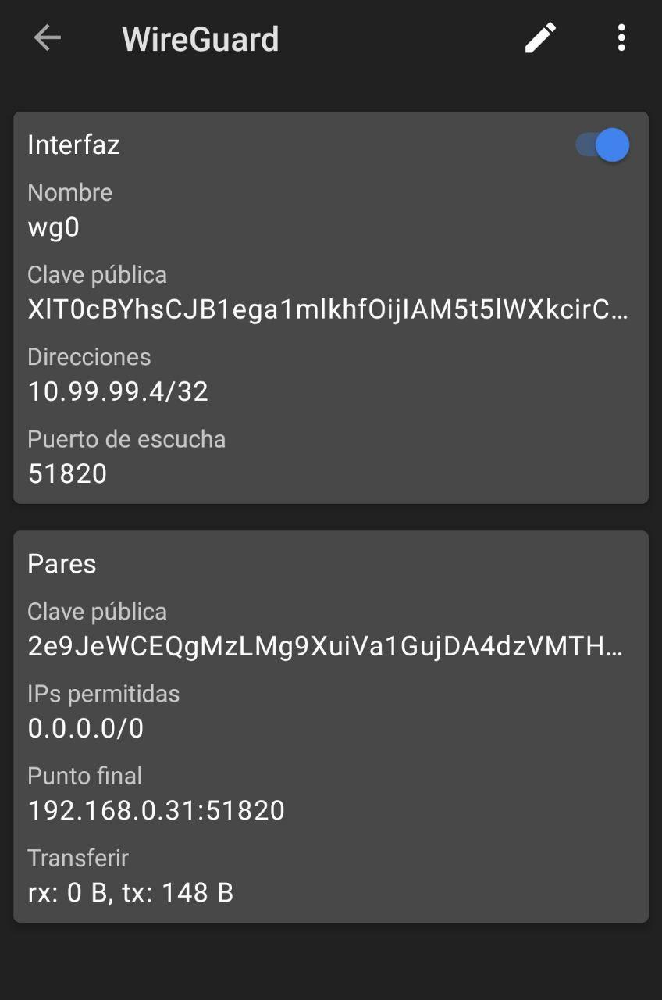

Ya solo tenemos que añadir el nuevo bloque “Peer” a la configuración del servidor:
```bash
nano wg0.conf 

# Server config
[Interface]
Address = 10.99.99.1
PrivateKey = AMY15UaxVGBf5RZGRTQ+GdO5sGZgopQnBW3zocHKG3k= # Clave privada del servidor
ListenPort = 51820

# Clients configs

# Cliente Android
[Peer]
Publickey = XlT0cBYhsCJB1ega1mlkhfOijIAM5t5lWXkcirCzzSo= # Clave pública del cliente
AllowedIPs = 10.99.99.4/32
PersistentKeepAlive = 25
```

Ahora ya podemos reiniciar el servicio en el servidor:
```bash
wg-quick down wg0

wg-quick up wg0
```

En este momento podemos ver que está conectado el cliente Android (tras iniciar el túnel en el dispositivo android):

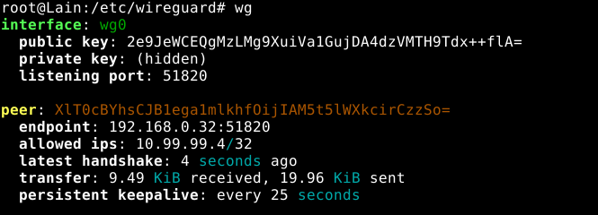

Ahora ya podemos realizar las pruebas de funcionamiento (he instalado una aplicación llamada PingTools Network Utilities para ejecutar los comandos adecuados):

- Ping y traceroute desde el cliente android al servidor VPN (anfitrión):

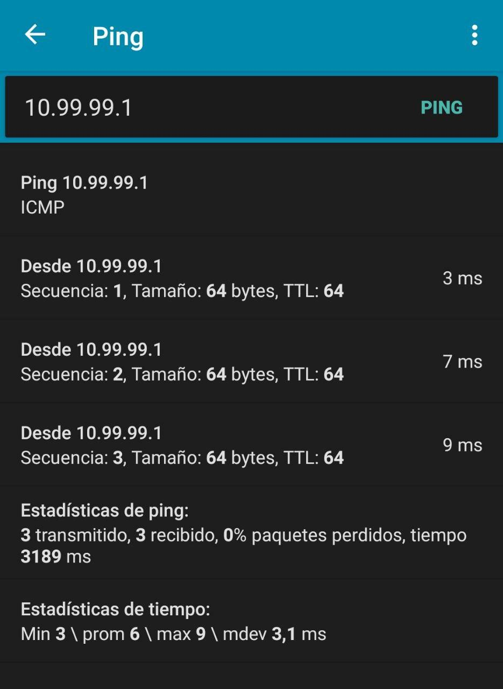

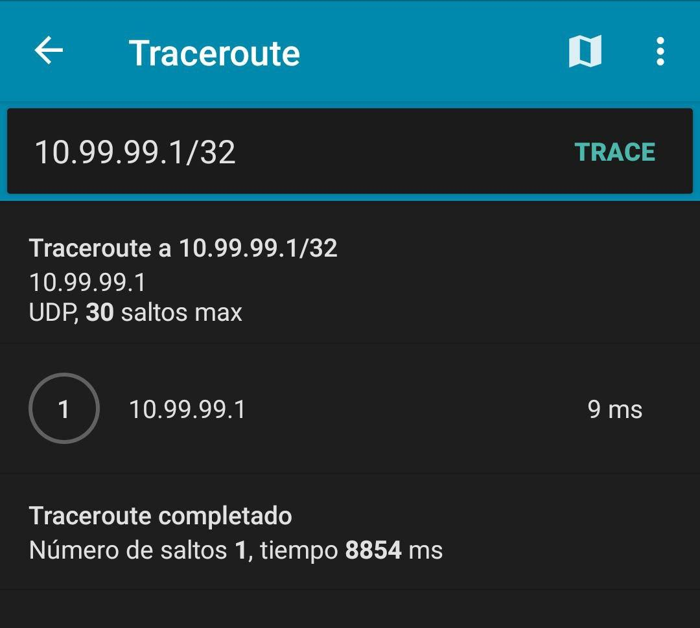

- Ping y traceroute desde el cliente interno a la interfaz del túnel en el cliente Android (creé un nuevo cliente interno para probar esto):

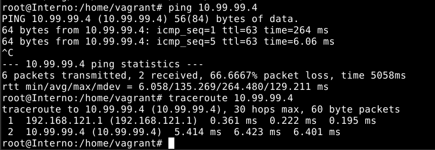

### Comparativa con OpenVPN

Después de realizar todos los pasos para establecer un acceso remoto con OpenVPN y Wireguard, me he dado cuenta de que hay algunas diferencias entre ambos protocolos y ninguna de ellas es mejor que la otra, sino que depende de las necesidades de cada usuario pero que respecto a mis necesidades, Wireguard me convence más.

Por ejemplo, en todas las pruebas que he realizado con máquinas virtuales, se ve claramente que Wireguard es mucho más veloz. Esto, en un entorno real, daría un salto cualitativo en la experiencia de usuario. Algo a destacar es que la configuración de Wireguard es mucho más sencilla y se comparte de la misma forma en los clientes, sin importar el sistema operativo. Y por último, no hay necesidad de crear una autoridad certificadora para Wireguard, lo cual es una gran ventaja a la hora de configurar el túnel, ya que no hay que preocuparse de crear un certificado para cada cliente. Simplemente se genera una clave privada y pública para cada cliente y se añade al fichero de configuración del servidor.

------------------------------------------------------------------------------------------------------------------------
