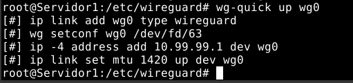
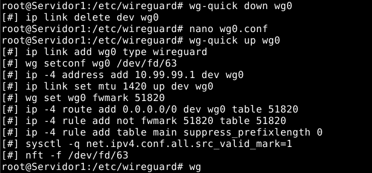
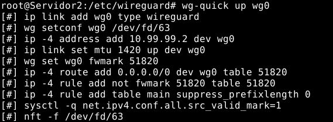
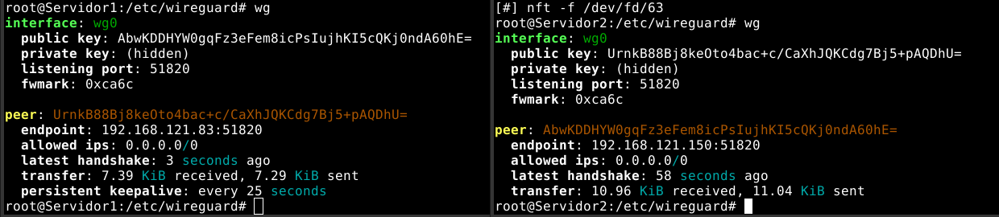
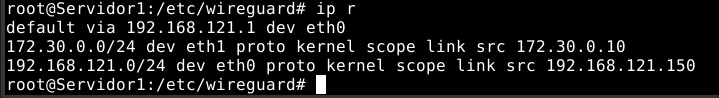
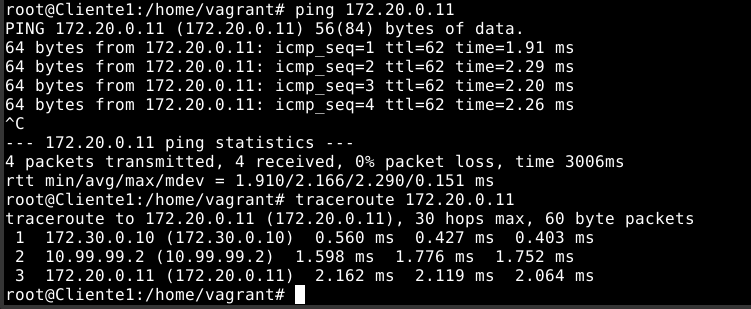
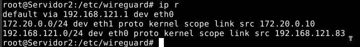

# **SAD Práctica 6**
## **Redes Privadas Virtuales**
#### Realizado por: **Iván Piña Castillo**

------------------------------------------------------------------------------------------------------------------------

## 4. VPN sitio a sitio con WireGuard (10 puntos)

     Configura una VPN sitio a sitio usando WireGuard. Documenta el proceso adecuadamente y compáralo con el del apartado B.

En esta ocasión, estamos montando el mismo escenario que en el apartado B pero usando Wireguard para la conexión. Por lo tanto, he usado el mismo archivo 'Vagrantfile' para montar el entorno. Una vez hecho esto, necesitamos configurar correctamente las máquinas para que puedan establecer la conexión.

Empezando por ambos clientes, es necesario modificar su ruta predeterminada (si no se había hecho con Vagrant, este paso no sería requerido):

En el cliente del escenario 1:
```bash
ip r del default

ip r add default via 172.30.0.10
```

En el cliente del escenario 2:
```bash
ip r del default

ip r add default via 172.20.0.10
```

Una vez que hemos hecho esto, podemos pasar a las máquinas que actuarán como servidor y cliente de Wireguard.

En la máquina “Servidor” del escenario 1 instalamos en primer lugar wireguard:
```bash
apt install wireguard
```

A continuación activamos el bit de forwarding y hacemos esta configuración permanente:
```bash
echo 1 > /proc/sys/net/ipv4/ip_forward
```
```bash
nano /etc/sysctl.conf                                          

net.ipv4.ip_forward=1
```

Después, al igual que hicimos antes, tenemos que generar el par de claves:
```bash
cd /etc/wireguard
wg genkey | tee serverprivatekey | wg pubkey > serverpublickey
```
```bash
cat serverprivatekey
gJRR9JNcc+FL2/rNisGG1s8XioXV3Dsf8CJJeQ9hG2I=
```


```bash
cat serverpublickey
AbwKDDHYW0gqFz3eFem8icPsIujhKI5cQKj0ndA60hE=
```


Ahora ya podemos crear el fichero de configuración, que será muy parecido al que creamos en el apartado anterior:
```bash
nano wg0.conf

# Server config
[Interface]
Address = 10.99.99.1
PrivateKey = gJRR9JNcc+FL2/rNisGG1s8XioXV3Dsf8CJJeQ9hG2I= # Clave privada del servidor
ListenPort = 51820
```

En este momento, ya podemos probar a iniciar el servicio:
```bash
wg-quick up wg0
```


Podemos ver que el servicio se ha iniciado correctamente:
```bash
wg
```


Ahora debemos configurar la máquina “Servidor2” que actuará como cliente de wireguard en el escenario 2. Así pues, en primer lugar instalamos wireguard en esa máquina:
```bash
apt install wireguard
```

Y activamos el bit de forwarding, haciéndolo permanente:
```bash
echo 1 > /proc/sys/net/ipv4/ip_forward
```
```bash
nano /etc/sysctl.conf                                          

net.ipv4.ip_forward=1
```

Generaremos el par de claves que usará esta máquina:
```bash
cd /etc/wireguard

wg genkey | tee clientprivatekey | wg pubkey > clientpublickey
```
```bash
cat clientprivatekey
cG/yhjjEESUFZtzIHTTsMDHRYDbE2pTrxMG/urTbEGE=
```


```bash
cat clientpublickey
UrnkB88Bj8keOto4bac+c/CaXhJQKCdg7Bj5+pAQDhU=
```


Y creamos el fichero de configuración que usará esta máquina tal y como hicimos en el aparatado anterior, creando también el bloque de “Peer”:
```bash
nano wg0.conf

[Interface]
Address = 10.99.99.2
PrivateKey = cG/yhjjEESUFZtzIHTTsMDHRYDbE2pTrxMG/urTbEGE= # Clave privada del cliente
ListenPort = 51820

[Peer]
PublicKey = AbwKDDHYW0gqFz3eFem8icPsIujhKI5cQKj0ndA60hE= # Clave pública del servidor
AllowedIPs = 0.0.0.0/0
Endpoint = 192.168.121.150:51820
```

Antes de activar este servicio, tenemos que añadir el correspondiente bloque “Peer” en el fichero de configuración del escenario 1:
```bash
nano wg0.conf

# Server config
[Interface]
Address = 10.99.99.1
PrivateKey = gJRR9JNcc+FL2/rNisGG1s8XioXV3Dsf8CJJeQ9hG2I= # Clave privada del servidor
ListenPort = 51820

# Cliente Escenario 2
[Peer]
Publickey = UrnkB88Bj8keOto4bac+c/CaXhJQKCdg7Bj5+pAQDhU= # Clave pública del cliente
AllowedIPs = 0.0.0.0/0
PersistentKeepAlive = 25
```

Ahora reiniciamos el servicio en la máquina “Servidor” del escenario 1:
```bash
wg-quick down wg0

wg-quick up wg0
```


Ya podemos iniciar el servicio en el escenario 2:
```bash
wg-quick up wg0
```


Y podemos ver que se ha establecido la conexión:



Ahora ya podemos realizar las pruebas necesarias:

- Rutas en la máquina “Servidor” del escenario 1:



- Ping y traceroute desde el cliente del escenario 1 al cliente del escenario 2:



- Rutas en la máquina “Servidor2” del escenario 2:



- Ping y traceroute desde el cliente del escenario 2 al cliente del escenario 1:


## Comparativa con OpenVPN

Tras la configuración, he podido comprobar que Wireguard es mucho mejor que OpenVPN en cuanto a velocidad, estabilidad de la conexión y facilidad de configuración. Esto es algo que he podido notar al realizar pruebas y establecer conexiones entre máquinas virtuales. Los resultados son bastante superiores a los que obtenía con OpenVPN, con una mayor rapidez y estabilidad.

OpenVPN es una herramienta más antigua y que tiene más años de desarrollo que Wireguard, por lo que es posible que en un futuro Wireguard mejore aún más y se convierta en una herramienta más potente y eficiente que OpenVPN.

En conclusión, la configuración de Wireguard es mucho más sencilla, rápida y con resultados mejores que los que obtenía con OpenVPN. Al probarlo, he comprobado que es mucho más eficiente tanto en lo que respecta a la velocidad como a la estabilidad de la conexión. 


------------------------------------------------------------------------------------------------------------------------
